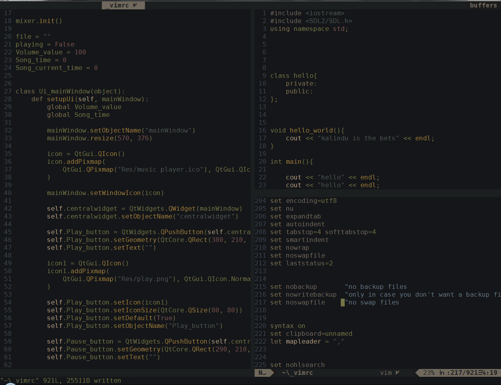

# GreenCode

<h2>I didn't like any theme so I created my own using the  ackyshake/Spacegray.vim </h2>

<h3>Install:</h3>

```Plug 'kalindu1/GreenCode.vim'```

<h3>Set the colorscheme:</h3>

```colorscheme GreenCode```
<h3>This color scheme is made for gvim</h3>

<h5>I like using 'biogoo' airline theme with this theme</h5>

```let g:airline_theme = 'biogoo'```

<h3>Pictures:</h3>


